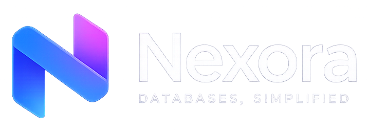

<div align="center">
  
</div>

# Nexora

[](https://github.com/privixy/nexora/actions/workflows/ci.yml)
[](https://github.com/privixy/nexora/actions/workflows/release.yml)
[](./LICENSE)

Nexora is an open-source desktop SQL workspace for PostgreSQL, MySQL/MariaDB, SQLite and plugin-driven database integrations. It is built with React, TypeScript, Tauri and Rust.

## Features

- Connection management for local and remote databases
- SQL editor with tabs, autocomplete, query history and saved queries
- Data grid with inline editing, export and JSON viewing
- SQL notebooks with Markdown cells, variables, charts and export
- Visual query builder and Visual EXPLAIN
- Optional AI-assisted SQL generation and query explanation
- Built-in MCP server for local AI-agent workflows
- External driver plugin system over JSON-RPC stdio

## Database support

PostgreSQL, MySQL/MariaDB and SQLite ship built in. Additional databases are supported through plugins listed in [`plugins/registry.json`](./plugins/registry.json).

## Development

```bash
pnpm install
pnpm tauri dev
```

## Build

```bash
pnpm tauri build
```

## Plugin development

- [`plugins/PLUGIN_GUIDE.md`](./plugins/PLUGIN_GUIDE.md)
- [`plugins/PLUGIN_TUTORIAL.md`](./plugins/PLUGIN_TUTORIAL.md)
- [`packages/plugin-api`](./packages/plugin-api)
- [`packages/create-plugin`](./packages/create-plugin)

## Respect the Tabularis team

Nexora is forked from the original Tabularis repository. We are grateful to the Tabularis team for their work and foundation that made this project possible.

## License

Apache License 2.0
